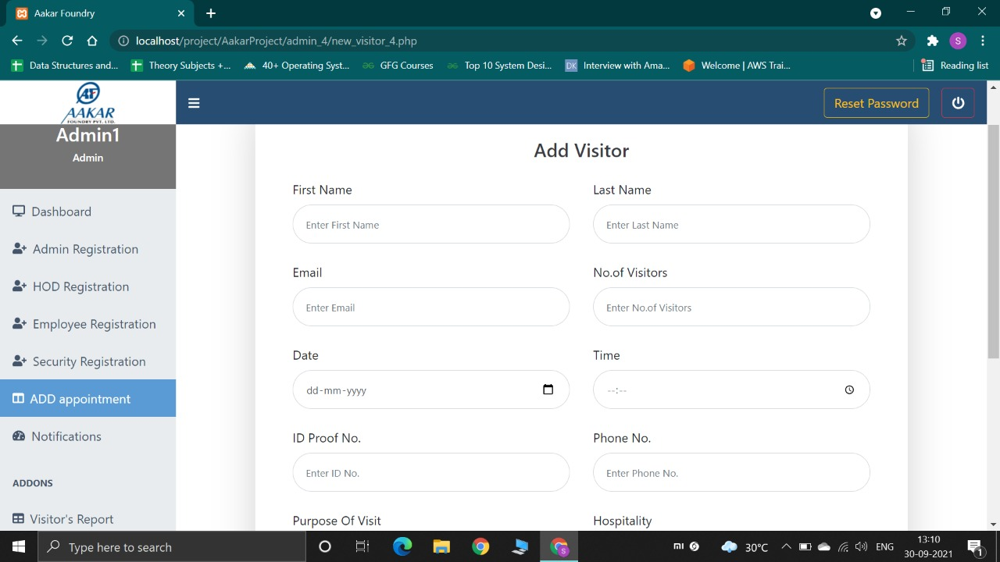

# AakarProject
### Repository for Aakar Foundation Webapp
<br>

## Directions for utilizing the WebApp

```
The WebApp can be divided into 2 major applications:
	1. Visitor Management System
	2. Employee Leave Management System
```

1. **Login**:<br>
	Upon entering the website, if the user is not logged in, they will be directed to the login page. The user can log in using their credentials.
	The user has to select the type of employee to log in as, basically:
	* Admin
	* HOD
	* Employee
	* Security


<br><br>

2. **Admin Homepage/Dashboard (All users)**:<br>
	After successful Login, the user will be directed to the homepage/dashboard of the application. The Dashboard contains the option to Logout, as well as to Reset the Account Password.
	> Certain functionalities will be available only to a certain users depending upon their access level


<br><br>

3. **User Registration (Admin)**:<br>
Only an admin can register another user. Depending upon which tab the registration is done through, the roles will be assigned to the user. For registration, following details of the user are required:
	* First Name
	* Last Name
	* Email (Must be unique)
	* Employee ID (Must be unique)
	* Phone No. (Must be unique)
	* Password
	> The password entered must be a default password which should be known to the employee being registered, and the employee can then later reset the password


.jpeg)

<br><br>


### 1. Visitor Management System:

1. **Adding Visitor Appointment (All users)**:<br>
	The user can then add a visitor appointment using the *Add Appointment* tab from the Side-Navbar. Following details of the visitor are required for booking a visit:
	* First Name
	* Last Name
	* Email
	* No. of visitors
	* Date of visit
	* Time of visit
	* ID Proof No. (Aadhar Card/PAN Card)
	* Phone No.
	* Purpose of visit
	* Hospitality required

	> There is also an option to book a conference room in case the visitor needs a room to conduct meetings. The following details are required for booking a room:
	>* Room Name
	>* Purpose of Room
	>* Start Time
	>* End Time



<br><br>

2. **One Time Password (Visitor)**:<br>
	After successful booking of the visit appointment, an Email will be sent to the visitor containing the One-Time Password which has to be shown to the security guard at the time of visit.


<br><br>

3. **During Visit (Security)**:<br>
	When the visitor arrives at the Aakar Foundary Premises for the scheduled visit, they need to show the OTP received on email. The Security enters this OTP in the corresponding visitor's field on the Security Dashboard.


	If the token id entered is valid, a request will be sent to the respective HOD/Admin for approval of entry to the visitor.


<br><br>

4. **Visit Approval (Admin/HOD)**:<br>
	The admin will receive a notification to approve the visit requested by the visitor. The admin can either approve or reject the visit.


	After the admin approves the visit, a notification will be sent to the Security Guard mentioning that the entry has been granted and then the Security can allow the visitor in the premises


<br><br>

5. **Ongoing Visits (Security)**:
	After the visit is completed, the security can go to the *Ongoing Visit* tab in the Side-Navbar and click on the *Out* button to mark the visit complete


<br><br>

6. **Total Visitors (Admin)**:<br>
	An admin can also check the total no. of visitors for a particular day by visiting the *Total Visitors* card on the Dashboard


<br>

> The security guard also has an option to book appointments for walk-in visitors

### 2. Employee Leave Management:

1. **Applying for Leave Pass (Employee)**:

	An Employee can apply for a leave pass by clicking on the *Leave Pass* tab on the Side-Navbar of their Dashboard. The following details are required for applying for a leave pass:
	>* Purpose of Leave
	>* Detailed Reason
	>* Start Time
	>* End Time


<br><br>

2. **Approval of Leave Pass (HOD)**:<br>
	Once the form for leave pass is submitted by the Employee, the request to approve the leave is received by the respective HOD. The HOD can either approve or reject the request.


<br><br>

3. **Notification of Approval of Leave Pass (Employee)**:<br>
	The employee will receive a notification whether the leave pass is accepted or rejected in the notifications tab.


<br><br>

4. **Start Leave (Security)**:
	If the leave is approved by the HOD, the Employee has to notify the security guard to note down the actual start time of the leave. The security guard will confirm the details of the Employee and accordingly, click on the *Start* button


<br><br>

5. **End Leave (Security)**:<br>
	To end the leave, the Employee has to report to the security. On the *Employee Leaves* tab, the Security can find the details of the Employee's ongoing leave and click on the *End* button to mark the leave as complete


<br><br>

6. **Total Employee Leave Passes (Admin)**:<br>
	An admin can also view the total employee leave passes for a particular day through the *Employee Leaves* card on the Dashboard.

